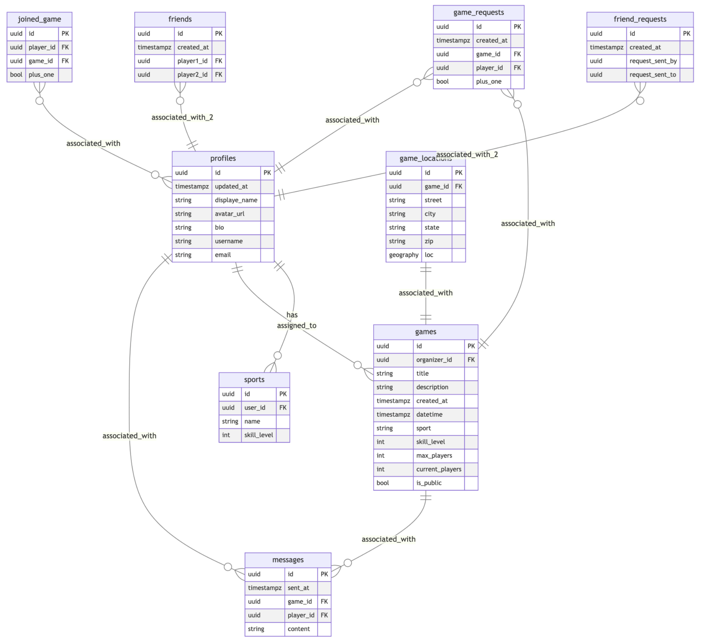
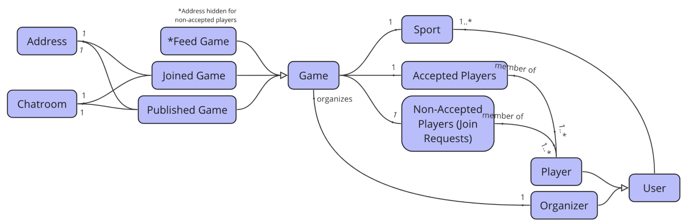

# Technical Documentation

## Introduction

### 1.1 Purpose
It can be difficult for people to organize future pick-up games or find live pick-up games. Organizers must communicate and coordinate with players through traditional methods such as texting, while players must have prior connections or friends or physically see the pick-up game in order to know it is happening.

Our app allows users to organize, find, and join pick-up games in a convenient and streamlined manner. Users have access to nearby games that fit their skill level and match the desired sport, while organizers can share and coordinate games with their friends or anyone nearby. Organizers can control game visibility (public vs. private), accept or reject user requests to join a game, and invite specific users to join, allowing full control over who has access to the game location and details. Organizers can coordinate user responsibilities for bringing gear, equipment, and more. Users can add friends and communicate easily with each other through game-specific chatrooms.

### 1.2 Scope
The scope of our app encompasses a social network for users to find and engage with their local community, make friends, find nearby games, and communicate with other players. Our app also functions as a tool for organizers to schedule and manage pickup games and their players. 

### 1.3 Audience
Our potential users include individuals who organize or want to organize pick-up games with their friends, as well as individuals looking to find and join pick-up games easily.

## System Overview

### 2.1 Architecture
Our app utilizes the client-server architecture, where the client (or frontend) provides the UI and allows the user to interact with the app, and the server (or backend) receives and processes requests from the client. We use Expo with React Native for the frontend, and Supabase for the backend.

### 2.2 Technologies Used
**Frontend**: 
- **Framework**: Expo with React Native
- **Navigation**: React Navigation
- **UI library**: Tamagui with NativeWind CSS

**Backend**: 
- **Database and Authentication**: Supabase Database
- **Storage**: Supabase Storage
- **Cloud Functions**: Supabase Cloud Functions

**Deployment**:
- **Distribution**: Expo's tools to build and publish updates to the Apple App Store and Google Play Store
- **CI/CD**: GitHub Actions

**Additional technologies**:
- **Version Control**: Git and GitHub
- **Testing Frameworks**: Jest and Detox
- **Caching**: Upstash Redis
- **Email Notifications**: Resend

### 2.3 Dependencies
- @babel/runtime: ^7.24.4
- @react-native-async-storage/async-storage: 1.21.0
- @react-native-community/datetimepicker: ^7.6.4
- @react-navigation/bottom-tabs: ^6.5.20
- @react-navigation/native: ^6.1.17
- @react-navigation/native-stack: ^6.9.26
- @supabase/supabase-js: ^2.42.1
- @tamagui/alert-dialog: ^1.94.4
- @tamagui/card: ^1.94.4
- @tamagui/checkbox: ^1.94.4
- @tamagui/config: ^1.94.4
- @tamagui/font-inter: ^1.94.4
- @tamagui/lucide-icons: ^1.94.4
- @tamagui/slider: ^1.94.4
- @tamagui/toast: ^1.94.4
- @testing-library/jest-dom: ^6.4.2
- @upstash/redis: ^1.29.0
- burnt: ^0.12.2
- expo: ^50.0.15
- expo-app-loading: ^2.1.1
- expo-dev-client: ~3.3.11
- expo-font: ~11.10.3
- expo-image-picker: ~14.7.1
- expo-location: ^16.5.5
- expo-status-bar: ~1.11.1
- expo-updates: ^0.24.12
- immer: ^10.0.4
- jest-expo: ~50.0.4
- nativewind: ^4.0.36
- react: 18.2.0
- react-native: 0.73.6
- react-native-css-interop: ^0.0.34
- react-native-elements: ^3.4.3
- react-native-reanimated: ~3.6.3
- react-native-safe-area-context: 4.8.2
- react-native-screens: ~3.29.0
- react-native-svg: ^14.1.0
- react-native-url-polyfill: ^2.0.0
- resend: ^3.2.0
- tamagui: ^1.94.4
- zustand: ^4.5.2

## Installation Guide

### 3.1 Prerequisites

Make sure you have these prerequisites installed: [npm](https://docs.npmjs.com/downloading-and-installing-node-js-and-npm) and [Expo CLI](https://docs.expo.dev/get-started/installation/).  

### 3.2 System Requirements

For testing the app using Expo Go, you will need a compatible mobile device (iOS or Android) with the Expo Go app installed. For iOS development, Xcode must be installed to run the iOS simulator. For Android development, Android Studio or an Android device/emulator must be set up.

### 3.3 Installation Steps

Follow the below steps to run the app locally on Expo Go.

1. Clone the repository and navigate to the root folder in the terminal.

2. Add a `.env` file in the root folder of this repository containing the fields in the`.env.example` file, and fill in the required environment variables.

3. Run `npm install` to install dependencies.

4. To use the Expo Go app: 

    a. Download the Expo Go app on your phone.

    b. Run `npx expo start --go`.
    
    c. Scan the QR code with the Expo Go app (Android) or the Camera app (iOS) and open the link.

5. To locally build the project:

    a. On iOS, to run the simulator on Xcode:

    ```shell
    expo prebuild --platform ios

    npx expo run:ios
    ```

    b. On Android (not tested yet):

    ```shell
    expo prebuild --platform android

    npx expo run:android
    ```

7. To login as a test user to the app, use the following credentials:

    ```shell
    email: admin@example.com
    password: password
    ```

Follow the below steps to download the build from the Expo Dashboard and run it on the Xcode simulator.

1. Navigate to our OOSE group's [Expo dashboard](https://expo.dev/accounts/oose-team-01).

2. Navigate to the [Pickup project](https://expo.dev/accounts/oose-team-01/projects/pickup).

3. Click on the most recent build.

4. Click "Download" and wait for the build to download.

5. Unzip the downloaded build.

6. Open Xcode simulator and drag the unzipped build onto the simulator.

## Configuration Guide

### 4.1 Configuration Parameters

- `app.json`: contains app information such as name, slug, icon, splash icon, etc.
- `babel.config.js`: configure presets and plugins such as NativeWind
- `eas.json`: configure build profiles, distribution settings, and submission configurations for EAS
- `jest.setup.js`: set up the Jest testing environment
- `metro.config.js`: customize the Metro bundler configuration and integrate additional plugins like NativeWind 
- `package.json`: define and manage dependencies
- `tailwind.config.js`: configure Tailwind CSS
- `tamagui.config.js`: configure Tamagui, specify theme configuration, etc.
- `tsconfig.js`: configure TypeScript settings like compiler options, etc.

### 4.2 Environment Setup

Refer to the Installation Guide's Prerequisites and System Requirements. 

Run `npm install` to install all dependencies.

To set up the environment variables, add a `.env` file to the root of the project directory in the following format, as in `.env.example`, and fill it out with the correct keys:
  ```
  ANON_KEY=
  AUTOCOMPLETE_API_KEY=
  UPSTASH_TOKEN=
  RESEND_API_KEY=
  ```

### 4.3 External Services Integration

In order to use Pickup!, the following external keys/tokens are required in `.env`:
- `ANON_KEY`: The Supabase anon key, which will allow queries to the Pickup! production database.
- `AUTOCOMPLETE_API_KEY`: The `https://locationiq.com` API key necessary for the address autocomplete feature.
- `UPSTASH_TOKEN`: The token for Upstash Redis necessary to handle the cache.
- `RESEND_API_KEY`: The API key for Resend necessary to handle the email notifications.

## Usage Guide

### 5.1 User Interface Overview
For our user interface, our app is divided into four main views: Feed, My Games, Profile, and Friends.

The Feed view contains a feed of nearby public games and a feed of friends-only games, along with an option to filter the feed.

The My Games view contains a list of the user's published games and a list of the user's joined games, along with an option to create a new game. Published and joined games are managed by the user through this view.

The Profile view contains the user's profile information and options to edit their profile or logout.

The Friends view contains three tabs, one for viewing the friends list, one for viewing friend requests, and one for searching for other users. 

In addition, users will be greated by a page for logging in or registering when they open the app for the first time. 

### 5.2 User Authentication
Our app uses Supabase to authenticate and authorize our users. Users may register by entering an email, password, and unique username. They must click on the confirmation link sent to their email address before they can login using their email and password.

### 5.3 Core Functionality

- User profile
  - [must-have] As a user, I want to register for the app and login using my credentials, so that I can store and access my data.
  - [must-have] As a user, I want to view and edit my profile, including my username, display name, avatar, bio, sports that I’m interested in, and my skill level in each sport.

- CRUD operations on pickup games
  - [must-have] As an organizer, I want to create a pick-up game so that others can join it.
  - [must-have] As an organizer, I want to create a public game, so that any other users in my area can request to join the game.
  - [must-have] As an organizer, I want to create a friends-only game, so that my friends can request to join the game.
  - [must-have] As an organizer, I want to change my game’s visibility to public or friends-only, so that I can control who can view and request to join the game.
  - [must-have] As an organizer, I want to edit a game’s title, description, location, date, time, maximum number of players, and sport, so that players can see the game's most up-to-date details.
  - [must-have] As an organizer, I want to see a list of the games that I’ve organized, so that I can keep track of my upcoming games.
  - [must-have] As a player, I want to see a list of my accepted games, so that I can quickly access game details.
  - [must-have] As a player, I want games I’ve previously attended to no longer show up on my accepted games feed, so that I can clearly keep track of my current events.
  - [must-have] As an organizer, I want to be warned if there is another event going on in the same location and time that I am setting up my event.
  - [must-have] As an organizer, I want the addresses for my games to be autocompleted so I know I am submitting a valid address.

- Join requests, joining, and leaving pickup games
  - [must-have] As an organizer, I want accepted users to see my game’s location and non-accepted users to see the distance of my game’s location to their location.
  - [must-have] As an organizer, I want to accept or reject user requests to join, so that I can control who can join the game.
  - [must-have] As an organizer, I want to remove an accepted user from my game, so that they no longer have access to the game location or details.
  - [must-have] As a player, I want to request to join a game so that I can see the game details.
  - [must-have] As a player, I want to leave a game that I have already joined, so that I no longer receive game details or notifications.
  - [nice-to-have] As a player, I want to bring a +1 to a game, so that they can come too while keeping the number of players below maximum capacity. 

- Feed of nearby pickup games
  - [must-have] As a player, I want to see a feed of public games in my area so that I know which games I could join.
  - [must-have] As a player, I want my feed to also display games organized by my friends, so that I can request to join them.
  - [must-have] As a player, I want to change the limit on game distance from me so that I can view games in my nearby area.
  - [must-have] As a player, I want to be able to filter through games in my feed by skill level and sport type, so that I can join games relevant to me.

- Friends
  - [nice-to-have] As a player or organizer, I want to be able to click on another player in the accepted players list, join requests list, avatar in chatroom, or organizer in game view so I can view their profile.
  - [must-have] As a user, I want to search for another user by username, so that I can view their profile.
  - [must-have] As a user, I want to request to add a friend, so that we can view each other’s friends-only games in our feeds.
  - [must-have] As a user, I want to accept a friend request, so that we can view each other’s friends-only games in our feeds.
  - [must-have] As a user, I want to reject a friend request, so that they can’t see my friends-only games in their feed.
  - [must-have] As a user, I want to be able to view my requests, so I can see who wants to become my friend.
  - [must-have] As a user, I want to be able to view my friends list, so I can see all the users who I am currently friends with.
  - [nice-to-have] As an organizer, I want to send notifications to my friends when I create an event, so that they are aware and can join.

### 5.4 Advanced Features

- Email notifications
  - [nice-to-have] As an organizer, I want to send notifications to my friends when I create an event, so that they are aware and can join.
  - The following user stories were not originally in the roadmap but are integrated features in the app:
    - [nice-to-have] As a user, I want a notification to be sent to another user when I send them a friend request.
    - [nice-to-have] As a player, I want a notification to be sent to the organizer of a game when I request to join.

- Chatroom
  - [nice-to-have] As a user, I want to be able to communicate with other accepted users through a game-specific chatroom, so that we can coordinate or discuss the game.
  - [nice-to-have] As a player, I want to be able to quickly load and view chats from a chatroom so I don't have to wait for them to load.

## API Documentation (if applicable)

Since our app architecture uses Supabase as a BaaS, we do not have a publicly available API. 

However, we do utilize several third-party APIs, listed below, in order to handle caching and get location information for games.

1. `https://locationiq.com`: this API is necessary for our address autocomplete feature, which repeatedly searches for and presents matching addresses as the user types in an address. 
2. `https://geocode.maps.co`: we query this API in order to get latitude and longitude coordinates for a given address on the backend. 
3. `https://us1-pleased-kangaroo-41719.upstash.io`: we use Upstash Redis to handle caching for chatroom messages and other players' profile information. 
4. `https://api.resend.com/emails`: we use Resend to implement email notifications on friends-only game creation, friend requests, and join requests. In order to make this work, we registered the `pickup-app-notifications.com` domain and built an Edge Function on Supabase that posts the body of the desired email to Resend. 

### 6.1 Endpoints
None

### 6.2 Request and Response Formats
None

### 6.3 Authentication and Authorization
None

## Database Schema

### 7.1 Entity-Relationship Diagram

Entity-Relationship Diagram:



UML Diagram:



### 7.2 Table Definitions

- `profiles`: contains publicly accessible profile information for each user. 

- `sports`: contains publicly accessible sports information for each user. Users may add multiple sports to their profile. 

- `games`: contains game information (except location and address) and visibility status for each created game.

- `game_locations`: contains game location and address location for each created game.

- `game_requests`: contains player join requests for each game.

- `joined_game`: contains joined players for each game.

- `friends`: contains all friend relationships between users.

- `friend_requests`: contains friend requests between players.

- `messages`: contains chatroom messages for each game chatroom.

### 7.3 Relationships and Constraints

`profiles`
- `id` uuid, cannot be null
- `updated_at` timestamp with time zone, cannot be null
- `display_name` text
- `avatar_url` text
- `bio` text `length(bio) < 500`
- `username` text, must be unique, cannot be null, `length(username) < 20`, can contain letters, numbers, and underscores
- `email` text, cannot be null

`sports`
- `id` uuid, cannot be null
- `user_id` uuid, references `profiles.id`, cannot be null
- `name` text, cannot be null
- `skill_level` int4, cannot be null, `skill_level >= 0 and skill_level <= 2`

`games`
- `id` uuid, cannot be null
- `organizer_id` uuid, references `profiles.id`, cannot be null
- `title` text, cannot be null
- `description` text, `length(description) < 500`
- `created_at` timestamp with time zone, cannot be null
- `datetime`timestamp with time zone, cannot be null,
- `sport` text, cannot be null
- `skill_level` int4, cannot be null, `skill_level >= 0 and skill_level <= 2`
- `max_players` bigint, cannot be null, `max_players >= 1`
- `current_players` bigint, cannot be null
- `is_public` boolean, cannot be null

`game_locations`
- `id` uuid, cannot be null
- `game_id` uuid, references `games.id`, cannot be null
- `street` text, cannot be null
- `city` text, cannot be null
- `state` text, cannot be null
- `zip` text, cannot be null
- `loc` "extensions"."geography"(Point,4326)

`joined_game`
- `id` uuid, cannot be null
- `player_id` uuid, references `profiles.id`, cannot be null
- `game_id` uuid, references `games.id`, cannot be null
- `plus_one` boolean, cannot be null

`game_requests`
- `id` uuid, cannot be null
- `created_at` timestamp with time zone, cannot be null
- `player_id` uuid, references `profiles.id`, cannot be null
- `game_id` uuid, references `games.id`, cannot be null
- `plus_one` boolean, cannot be null

`friend_requests`
- `id` uuid, cannot be null
- `created_at` timestamp with time zone, cannot be null
- `request_sent_by` uuid, references `profiles.id`, cannot be null
- `request_sent_to` uuid, references `profiles.id`, cannot be null

`friends`
- `id` uuid, cannot be null
- `created_at` timestamp with time zone, cannot be null
- `player1_id` uuid, references `profiles.id`, cannot be null
- `player2_id` uuid, references `profiles.id`, cannot be null

`messages`
- `id` uuid, cannot be null
- `sent_at` timestamp with time zone, cannot be null
- `player_id` uuid, references `profiles.id`, cannot be null
- `game_id` uuid, references `games.id`, cannot be null
- `content` text, cannot be null

## Testing

### 8.1 Test Plan

We planned two approaches to testing our app: (a) unit tests and (b) frontend tests. All tests are run automatically on pushes or pull requests to `main` or `dev` via GitHub Actions.

The first approach, unit tests, targets the backend tables and custom postgreSQL functions written for our use case. The tests were written using pgTAP and are applied to a test database schema built by a migration file which contains all of our tables and functions. We first seed our database with example records of profiles, games, and more. Then, we test that all database tables are built with the correct columns, foreign key relationships, and data types. Lastly, we test that our custom postgreSQL functions behave as expected by manipulating the seed data, calling the function, and verifying the results.

Our second approach, frontend tests, targets our frontend components and tests whether they render correctly and handle data in the expected way. We used Jest to write our frontend tests. We focused on determining whether components render as expected, mocking the store and hooks, and verifying that button presses or other user interations were handled as expected. 

### 8.2 Test Results

We encountered a lot of difficulty with our frontend test suite. We ended with a total of 39.43% coverage in the front end with many tests failing, often due to continued issues with jest mocks. These are our front end test results: 

Test Suites: 22 failed, 6 passed, 28 total
Tests:       56 failed, 29 passed, 85 total
Snapshots:   0 total
Time:        47.924 s, estimated 66 s

For the unit tests, we were not able to get all tests to run/pass, but the output is as follows:

```
Test Summary Report
-------------------
./unitTests.sql (Wstat: 0 Tests: 107 Failed: 0)
  Parse errors: Tests out of sequence.  Found (1) but expected (104)
                Tests out of sequence.  Found (2) but expected (105)
                Tests out of sequence.  Found (3) but expected (106)
                Tests out of sequence.  Found (3) but expected (107)
                Bad plan.  You planned 1 tests but ran 107.
Files=1, Tests=107,  2 wallclock secs ( 0.04 usr  0.01 sys +  0.02 cusr  0.02 csys =  0.09 CPU)
Result: FAIL
```

### 8.3 Known Issues and Limitations

For our frontend testing, one of the biggest difficulties we encountered was mocking our zustand store (useStore), which is manipulated in virtually every component. However, many components import and use different functions and variables from the store, making each store mock unique for each component. Testing the store itself proved to be very difficult as well. As such, many tests did not properly render because of issues with the mocked store, which caused cascading error with the other tests that relied on a properly rendered component. By the same logic, an improperly mocked store also ended up hurting our overall testing coverage, as the tests treated the non-rendered components and functions as non-existent. 

## Deployment

### 9.1 Deployment Process

We build and deploy our app automatically on pushes to `main` via GitHub Actions using Expo EAS. `.yml` scripts written to automate this process are available at `./.github/workflows`. 

## Glossary

### 12.1 Terms and Definitions

None